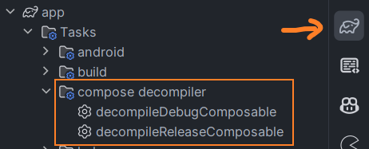
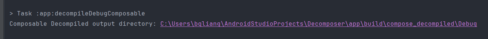

# Compose Decompiler Plugin

A Gradle plugin for Android/Kotlin projects that automatically decompiles classes containing `@Composable` functions.

This tool helps developers understand "the magic" behind Jetpack Compose by revealing the synthetic code, groups, and optimization logic generated by the Compose Compiler. It uses [ASM](https://asm.ow2.io/) for fast bytecode scanning and [Vineflower](https://github.com/Vineflower/vineflower) for high-quality decompilation to Java or Kotlin.

## Features

* **Smart Filtering:** Only decompiles classes containing methods annotated with `@Composable`.
* **Variant Aware:** Automatically creates tasks for each build variant (e.g., `debug`, `release`).
* **High-Fidelity Decompilation:** Uses Vineflower to restore generic signatures, inner classes, and remove bridge methods.
* **Configurable Output:** Choose between Java (default) or Kotlin output formats.


## Apply the Plugin 


Add the plugin to your module-level `build.gradle.kts` file using the plugin ID defined in the project configuration.

```kotlin
plugins {
    id("org.jetbrains.kotlin.plugin.compose") // required
    // add the line below
    id("io.github.bqliang.compose-decompiler") version "1.0.0"
}
```


## Configuration

You can configure the output directory and the decompilation language using the `composeDecompiler` extension block.

```kotlin
composeDecompiler {
    // Optional: Configure where the decompiled files will be saved.
    // Default is "${project.buildDir}/compose_decompiled"
    outputDir = layout.buildDirectory.dir("custom_output_dir")

    // Optional: Set to 'true' to attempt decompiling back to Kotlin syntax.
    // Default is 'false' (decompiles to Java), which is often better for 
    // inspecting the actual low-level logic generated by the compiler.
    ktEnable = true // default: false
}
```

## Usage

### Execute from IDE

Open the Gradle tasks window on the sidebar and find the `compose decompiler` group. Double-click the task for your desired build variant (e.g., `decompileDebugComposable`) to start the decompilation process.



After the task finishes successfully, check the **Build Output** console. Look for the log line starting with `Compose Decompiler output directory:`. This indicates where your decompiled Java/Kotlin files have been generated.



### Execute from Terminal

Alternatively, you can run the tasks via the command line. First, execute `./gradlew :app:tasks` to list all tasks, you can find the task group `compose decompiler` there: 

```
Compose decompiler tasks
------------------------
decompileDebugComposable - decompile Composables bytecode to Java
decompileReleaseComposable - decompile Composables bytecode to Java
```

Then, execute the specific task you need:

```bash
./gradlew :app:decompileDebugComposable
```


## How It Works

1. **Scanning**: When the task runs, it scans the compiled `.class` files using ASM. It looks for the specific `Landroidx/compose/runtime/Composable;` annotation signature.

2. **Filtering**: It skips standard classes and only targets those relevant to Compose UI to save time.

3. **Decompiling**: It passes the filtered class files to the Vineflower engine.

4. **Formatting**: The decompiler is configured to remove synthetic flags but keep essential structure to make the compiler-generated code readable.


## License

```
Copyright 2025 bqliang

Licensed under the Apache License, Version 2.0 (the "License");
you may not use this file except in compliance with the License.
You may obtain a copy of the License at

https://www.apache.org/licenses/LICENSE-2.0

Unless required by applicable law or agreed to in writing, software
distributed under the License is distributed on an "AS IS" BASIS,
WITHOUT WARRANTIES OR CONDITIONS OF ANY KIND, either express or implied.
See the License for the specific language governing permissions and
limitations under the License.
```
